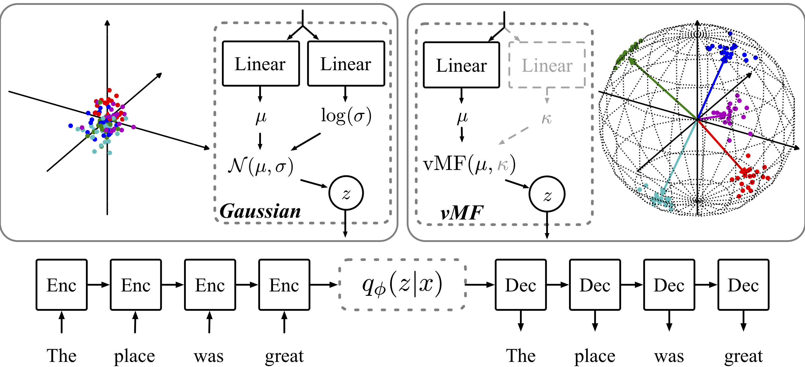

Spherical Latent Spaces for Stable Variational Autoencoders (vMF-VAE)
=======================

In this repo, we provide the experimental setups and inplementation for the algorithms described in:

    Spherical Latent Spaces for Stable Variational Autoencoders.
    Jiacheng Xu and Greg Durrett. EMNLP 2018.
    
    
## About

Keyword: **PyTorch**, **VAE**, **NLP**, **vMF**
What to get from this repo: 
* Original **Gaussian VAE**;
* Novel **von-Mises Fisher VAE (vMF-VAE)** with tuned hyper-parameters.

## Illustration
#### Optimization

Figure: the visualization of optimization of how q varies over time for a single example during learning.  

* Gaussian: the KL term tends to pull the model to-wards the prior (moving from μ,σ to μ′,σ′);
* vMF: there  is  no such  pressure  towards  a single distribution. If we fix the dimension and the kappa, KL term is a constant in the optimization objective.

#### Comparison of the Model

Figure: the model architecture. The left one is Gaussian and the right one is vMF. More details in paper.
## Setup
The environment base is Python 3.6 and Anaconda.

The codes are originally developed in PyTorch 0.3.1 and upgraded to PyTorch 0.4.1.

    conda install pytorch=0.4.1 torchvision -c pytorch
    pip install tensorboardX

### Data

#### Data for Document Model
In this paper, we use the exact same pre-processed dataset, 20NG and RC, as Miao et al. used in 
[Neural Variational Inference for Text Processing](https://arxiv.org/abs/1511.06038). Here is the [link to Miao's repo](https://github.com/ysmiao/nvdm).
* [Download RC](https://utexas.box.com/s/36iue908zi0m41ee4ciy8e2xi48bcwko) (Email me or submit an issue if it doesn't work)
* Location of 20 News Group(20ng): `data/20ng`.

#### Data for Language Model
We use the standard PTB and Yelp. Datasets are included in `data`.

## Running

#### Set up Device: CUDA or CPU

The choice of cpu or gpu can be modified at `NVLL/util/gpu_flag.py`.

### Explanation of Options \& Arguments

If you want to play around the {Gaussian, vMF} VAE model for {document model, language model}, there are many possible settings.
You can pass command-line arguments and the `NVLL/argparser.py` will handle the arguments. I will explain some nontrivial arguments. 

| Option        | Usage           | Value (Range) |
| ------------- |:-------------| :-----|
| dist | which distribution to use | {nor, vmf} |
| lat_dim | dimension of the latent variable | Int |
| kl_weight | the weight term before KL term in the objective funtion | 1 (default), any |
| exp_path | The location for exp logs and saving files. | `YOUR/EXP` |
| root_path | The location of the git repo. data is a sub-dir. | `YOUR/vmf_vae_nlp` |
| ---- | Args Below Only availble for NVRNN | ---- |
| input_z | Input the latent code z at every time step during decoding | True (default) or False |
| mix_unk | How much of the input is mixed with UNK token. 0 = Using ground truth as input (Standard setting) and 1 = Using UNK as input (Inputless setting) | [0.0, 1.0] |
| cd_bow | Condition on Bag-of-words. 0=not conditioned on BoW.  | 0 or int(like 200). |
| cd_bit | Condition on sentiment bit for the Yelp dataset. Not available for PTB. 0=not conditioned on sentiment bit.  | 0 or int(like 50). |
### Train and Test

#### Training Neural Variational Document Model (NVDM)
    
    cd NVLL
    # Training vMF VAE on 20 News group
    PYTHONPATH=../ python nvll.py --lr 1 --batch_size 50 --eval_batch_size 50 --log_interval 75 --model nvdm --epochs 100  --optim sgd  --clip 1 --data_path data/20ng --data_name 20ng  --dist vmf --exp_path YOUR/EXP --root_path YOUR/vmf_vae_nlp   --dropout 0.1 --emsize 100 --nhid 400 --aux_weight 0.0001 --dist vmf --kappa 100 --lat_dim 25
    
    # Training vMF VAE on RC
    PYTHONPATH=../ python nvll.py --lr 1 --batch_size 50 --eval_batch_size 50 --log_interval 1000 --model nvdm --epochs 100  --optim sgd  --clip 1 --data_path data/rcv --data_name rcv  --dist vmf --exp_path YOUR/EXP --root_path YOUR/vmf_vae_nlp   --dropout 0.1 --emsize 400 --nhid 800 --aux_weight 0.0001 --dist vmf --kappa 150 --lat_dim 50

#### Training Neural Variational Recurrent Language Model (NVRNN)
     
     cd NVLL
     
     # --cd_bow 200
     # Condition on BoW
     # --cd_bow 0
     # NOT Condition on BoW. Default setting
     
     
     # --cd_bit 50
     # Condition on sentiment bit. Only for Yelp.
     # --cd_bit 0
     # Not Condition on sentiment bit. Only for Yelp. In this case, sentiment bit will be skipped. Default Setting.
     
     # --swap 0.0 --replace 0.0
     # Default setting. No random swapping of encoding sequence.
     
     
     # Training vMF VAE on PTB
     # Example
     PYTHONPATH=../ python nvll.py --lr 10 --batch_size 20 --eval_batch_size 20 --log_interval 500 --model nvrnn --epochs 100  --optim sgd --data_name ptb --data_path data/ptb --clip 0.25 --input_z --dropout 0.5 --emsize 100 --nhid 400 --aux_weight 0  --nlayers 1 --swap 0.0 --replace 0.0   --exp_path YOUR/EXP --root_path YOUR/vmf_vae_nlp --cd_bit 0 --cd_bow 0 --dist vmf --kappa 80 --mix_unk 1 --lat_dim 50 --norm_max 1
     
     # Training vMF VAE on Yelp
     PYTHONPATH=../ python nvll.py --lr 10 --batch_size 20 --eval_batch_size 20 --log_interval 500 --model nvrnn --epochs 100  --optim sgd --data_name ptb --data_path data/ptb --clip 0.25 --input_z --dropout 0.5 --emsize 100 --nhid 400 --aux_weight 0  --nlayers 1 --swap 0.0 --replace 0.0   --exp_path YOUR/EXP --root_path YOUR/vmf_vae_nlp --cd_bit 50 --cd_bow 0 --dist vmf --kappa 80 --mix_unk 0 --lat_dim 50 --norm_max 1
## Reference
Please cite:

        
    @InProceedings{xu2018,
      author =      "Xu, Jiacheng and Durrett, Greg",
      title =       "Spherical Latent Spaces for Stable Variational Autoencoders",
      booktitle =   "Proceedings of the 2018 Conference on Empirical Methods in Natural Language Processing",
      publisher = "Proceedings of the 2018 Conference on Empirical Methods in Natural Language Processing",
      year =        "2018",
      address =     "Brussels, Belgium",
    }
    
    
For other implementation of vMF VAE, please refer to

1. Kelvin Guu's [repo](https://github.com/kelvinguu/neural-editor) and [paper](https://arxiv.org/abs/1709.08878). 
2. Tim R. Davidson's [repo (TensorFlow)](https://github.com/nicola-decao/s-vae-tf), 
[repo (PyTorch)](https://github.com/nicola-decao/s-vae-pytorch),
[paper](https://arxiv.org/abs/1804.00891) 
and [Supplementary material](http://auai.org/uai2018/proceedings/supplements/Supplementary-Paper309.pdf)

## Contact
Submit an issue here or find more information in my [homepage](http://www.cs.utexas.edu/~jcxu/).
